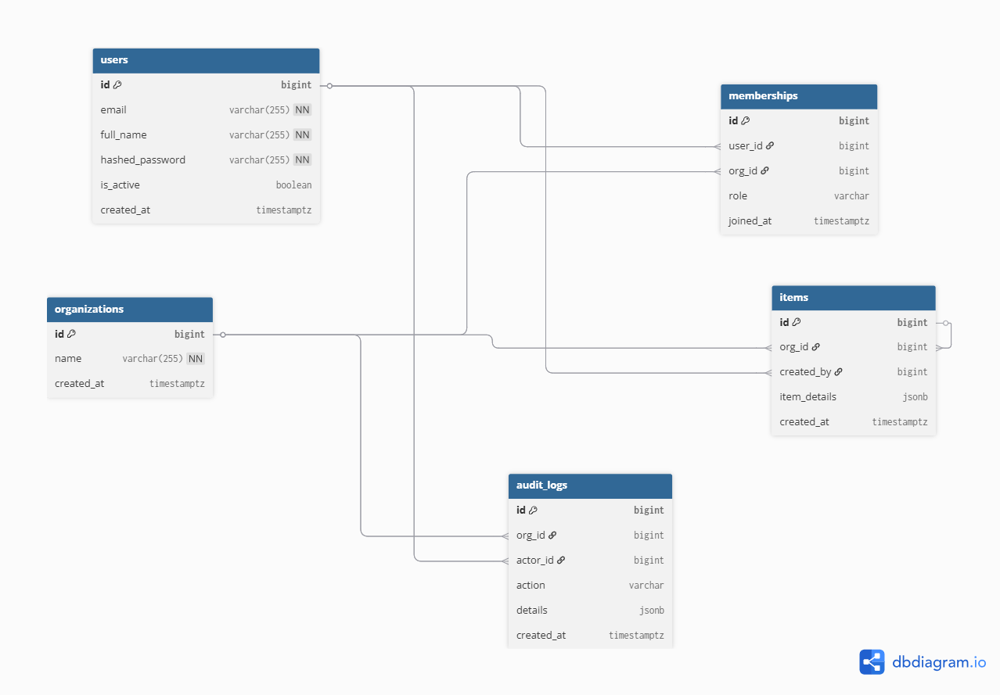

# Multi-Tenant Organization Manager

A secure, async, multi-tenant backend service built with **FastAPI**, **SQLAlchemy 2.0 (async)**, **PostgreSQL**, **JWT authentication**, and **RBAC authorization**.

---

## Quick Start

```bash
# 1. Clone the repo
git clone https://github.com/hafsaMuhammad/Multi-Tenant-Organization-Manager.git
cd org-manager

# 2. Set environment variables
cp .env.example .env
# Edit .env – at minimum set ANTHROPIC_API_KEY for the chatbot feature

# 3. Start everything
docker compose up --build
```

The API will be available at **http://localhost:8000**  
Interactive docs: **http://localhost:8000/docs**

---

## Architecture

```
org-manager/
├── app/
│   ├── api/v1/endpoints/  
│   │   ├── auth.py
│   │   └── organizations.py
│   ├── core/
│   │   ├── config.py      
│   │   └── security.py     
│   ├── db/
│   │   ├── session.py      
│   │   └── init_indexes.py
│   ├── dependencies/
│   │   └── auth.py         
│   ├── models/
│   │   └── models.py      
│   ├── schemas/
│   │   └── schemas.py      
│   ├── services/           
│   │   ├── auth_service.py
│   │   ├── org_service.py
│   │   ├── item_service.py
│   │   ├── audit_service.py
│   │   └── chatbot_service.py
│   └── main.py            
├── tests/
│   ├── conftest.py         
│   ├── test_auth.py
│   ├── test_rbac.py
│   └── test_isolation.py
├── Dockerfile
├── docker-compose.yml
├── init.sql               
└── requirements.txt
```

### Layer Responsibilities

| Layer | Responsibility |
|---|---|
| **Endpoints** | HTTP parsing, response shaping, dependency injection |
| **Dependencies** | JWT validation, membership lookup, role enforcement |
| **Services** | Business logic, DB queries, audit log creation |
| **Models** | SQLAlchemy ORM, relationships, constraints |
| **Schemas** | Pydantic validation, serialization |

---

## Database Design

```
┌─────────────┐       ┌──────────────────┐       ┌──────────────────┐
│    users    │       │   memberships    │       │  organizations   │
│─────────────│       │──────────────────│       │──────────────────│
│ id (PK)     │──┐    │ id (PK)          │    ┌──│ id (PK)          │
│ email       │  └───▶│ user_id (FK)     │◀───┘  │ name             │
│ full_name   │       │ org_id  (FK)─────│───────▶│ created_at       │
│ hashed_pw   │       │ role (admin|mbr) │       └──────────────────┘
│ is_active   │       │ joined_at        │
│ created_at  │       └──────────────────┘
└─────────────┘
       │                                          ┌──────────────────┐
       │                                          │      items       │
       │                                          │──────────────────│
       └─────────────────────────────────────────▶│ id (PK)          │
                                                  │ org_id (FK)      │
                                                  │ created_by (FK)  │
                                                  │ item_details (J) │
                                                  │ created_at       │
                                                  └──────────────────┘

┌────────────────────────────────────────┐
│              audit_logs                │
│────────────────────────────────────────│
│ id (PK)                                │
│ org_id   (FK → organizations, nullable)│
│ actor_id (FK → users, nullable)        │
│ action   (enum)                        │
│ details  (JSONB)                       │
│ created_at (indexed)                   │
└────────────────────────────────────────┘
```

## Database Design



**Key constraints:**
- `memberships(user_id, org_id)` — unique index (one role per user per org)
- `audit_logs(org_id, created_at)` — composite index for time-range queries
- `users` — GIN index on `to_tsvector(full_name || email)` for full-text search

---

## API Reference

### Authentication

| Method | Endpoint | Description |
|---|---|---|
| POST | `/api/v1/auth/register` | Register a new user |
| POST | `/api/v1/auth/login` | Login, receive JWT |

### Organizations

| Method | Endpoint | Auth | Role |
|---|---|---|---|
| POST | `/api/v1/organizations` | ✅ | Any authenticated user |
| POST | `/api/v1/organizations/{id}/user` | ✅ | Admin |
| GET | `/api/v1/organizations/{id}/users` | ✅ | Admin |
| GET | `/api/v1/organizations/{id}/users/search?q=` | ✅ | Admin |
| POST | `/api/v1/organizations/{id}/item` | ✅ | Admin or Member |
| GET | `/api/v1/organizations/{id}/item` | ✅ | Admin or Member |
| GET | `/api/v1/organizations/{id}/audit-logs` | ✅ | Admin |
| POST | `/api/v1/organizations/{id}/audit-logs/ask` | ✅ | Admin |

All protected endpoints require: `Authorization: Bearer <token>`

---

## Running Tests Locally

```bash
# Install deps (Python 3.11+)
python -m venv .venv
source .venv/bin/activate
pip install -r requirements.txt

# Run tests (testcontainers spins up a real Postgres automatically)
pytest -v --cov=app --cov-report=term-missing
```

Tests require Docker to be running (testcontainers uses it for the Postgres container).

---

## Environment Variables

| Variable | Default | Description |
|---|---|---|
| `DATABASE_URL` | `postgresql+asyncpg://postgres:postgres@db:5432/orgmanager` | Async DB URL |
| `SECRET_KEY` | (required) | JWT signing key (min 32 chars) |
| `ALGORITHM` | `HS256` | JWT algorithm |
| `ACCESS_TOKEN_EXPIRE_MINUTES` | `1440` | Token TTL (24h) |
| `ANTHROPIC_API_KEY` | `""` | Claude API key for chatbot |
| `DEBUG` | `false` | SQLAlchemy echo mode |

---

## Design Decisions & Trade-offs

### 1. SQLAlchemy 2.0 Async (not Tortoise/Beanie)
SQLAlchemy's async support with `asyncpg` gives full ORM power (relationships, migrations via Alembic, complex joins) while staying truly async. Trade-off: slightly more boilerplate than micro-ORMs.

### 2. Service Layer Pattern
Business logic lives entirely in `services/`. Endpoints are thin HTTP adapters. This makes services independently testable and keeps route handlers clean.

### 3. Dependency-Injected RBAC
`require_admin` / `require_member_or_admin` are FastAPI dependency factories. Role checks are **declarative at the route level** — no scattered `if user.role != "admin"` checks in business logic.

### 4. `get_db` with auto-commit / rollback
The `get_db` session dependency commits on success and rolls back on any exception. Services call `db.flush()` (not `commit()`) to get generated IDs mid-transaction, letting the outer session control the transaction boundary.

### 5. PostgreSQL Full-Text Search
Used native `tsvector`/`tsquery` with a GIN index instead of ILIKE or external search engines. This gives relevance ranking, stemming, and good performance without additional infrastructure.

### 6. Audit Log Design
`AuditLog.org_id` is nullable so registration events (pre-org) can still be logged. The `details` JSONB column stores context without needing to alter the schema for new action types.

### 7. Streaming Chatbot via SSE
The chatbot endpoint uses Server-Sent Events (`text/event-stream`) with Anthropic's streaming SDK. Non-streaming falls back to a synchronous response. The AI is given only **today's logs** to keep prompts focused and costs low.

### 8. Table Creation vs. Alembic
For simplicity, `Base.metadata.create_all` runs at startup (idempotent). A production setup would replace this with proper Alembic migrations — the structure supports it out of the box.

---

## Security Considerations

- Passwords hashed with **bcrypt** (cost factor 12)
- JWT tokens are stateless; revocation requires a token blacklist (not implemented — noted as a trade-off)
- Organization isolation enforced at the **dependency layer**, not at the service layer alone
- Non-root Docker user (`appuser`)
- `SECRET_KEY` read from environment — never hardcoded